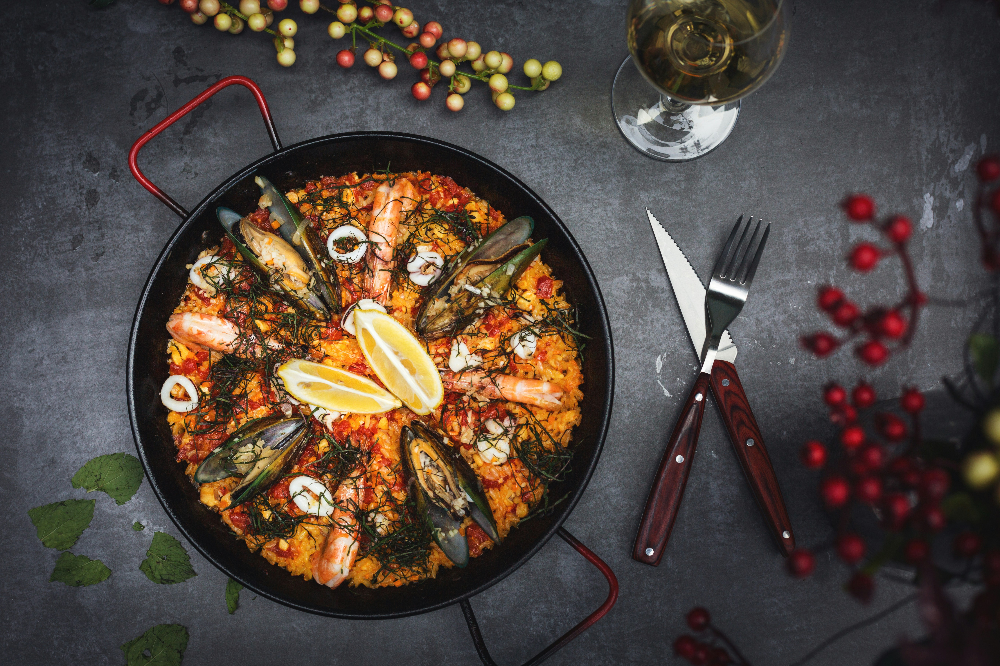

> ## Paella – Spain's Most Iconic Dish
>
> **Paella** is one of Spain's most famous and beloved traditional dishes, originating from the **Valencia** region on the country's eastern coast. It has become an international symbol of Spanish cuisine and is enjoyed by millions of people around the world.
>
> The dish is prepared using **short-grain rice**, which absorbs the rich flavors of the broth and seasonings. One of its signature ingredients is **saffron**, a spice that gives paella its distinctive golden-yellow color and unique aroma. Other common ingredients include olive oil, tomatoes, garlic, onions, green beans, peppers, and a variety of herbs and spices.
>
> There are many different styles of paella, each reflecting the local traditions and ingredients of different regions in Spain. Some of the most popular varieties include:
>
> - **Paella Valenciana** – The original recipe made with chicken, rabbit, green beans, tomatoes, and saffron.
> - **Seafood Paella (Paella de Marisco)** – Prepared with shrimp, mussels, clams, squid, and other fresh seafood.
> - **Mixed Paella (Paella Mixta)** – A popular variation combining both meat and seafood.
> - **Vegetarian Paella** – Made with seasonal vegetables, legumes, and aromatic herbs.
>
> Traditionally, paella is cooked in a wide, shallow pan over an open flame or charcoal fire. This cooking method allows the rice to cook evenly and creates the **socarrat**, a thin, crispy layer of caramelized rice at the bottom of the pan that is considered one of the dish's greatest delicacies.
>
> In Spain, paella is more than just a meal—it is a social tradition. Families and friends often gather on weekends or during celebrations to prepare and enjoy paella together. It is commonly served at festivals, holidays, and family gatherings, making it an important part of Spanish culture and hospitality.
>
> Whether enjoyed in a small village in Valencia or at a restaurant abroad, paella represents the rich culinary heritage of Spain and showcases the country's love of fresh ingredients, vibrant flavors, and shared dining experiences.